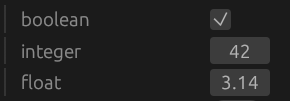
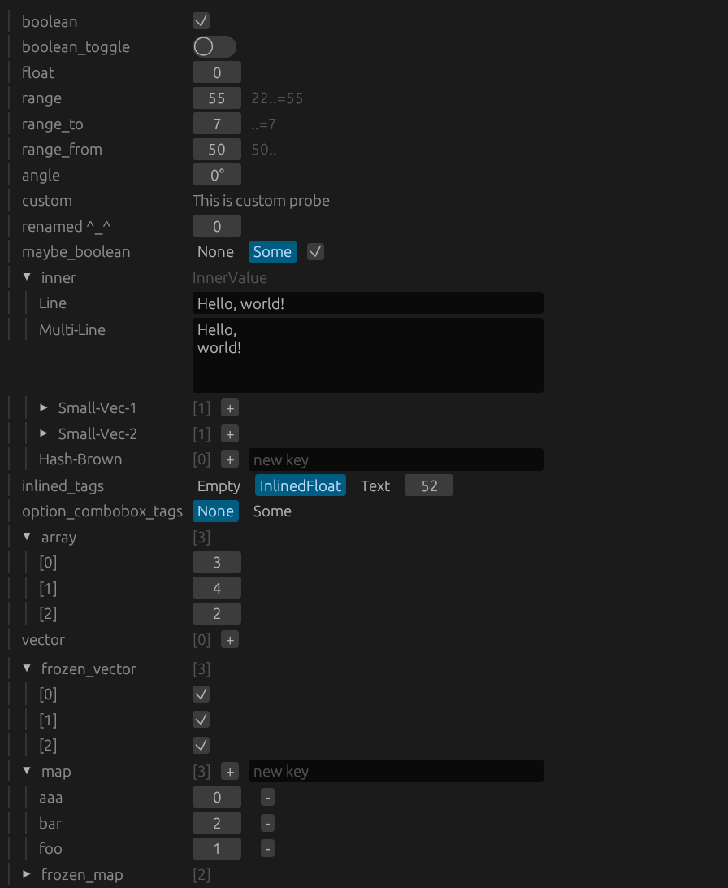

# Egui Probe

[](https://docs.rs/egui-probe/)
[](https://crates.io/crates/egui-probe)
[](https://discord.com/channels/1270330377847832646/1319419862719922289)

Effortlessly create UI widgets to display and modify value types using a derive macro with rich customization via attributes. This library is exclusively for the [egui](https://github.com/emilk/egui) UI framework.

## Features

- 🪄 **Derive Macro**: Automatically generate UI widgets for your types.
- 🎨 **Rich Customization**: Customize the generated widgets using attributes.
- 🚀 **Seamless Integration**: Designed to work seamlessly with egui.

## Getting Started

Add `egui_probe` to your `Cargo.toml`:

```toml
[dependencies]
egui_probe = "0.5.2"
```

## Usage

Derive `EguiProbe` for your types.
Use attributes to customize the UI:

### Simple Example

```rust
#[derive(EguiProbe)]
struct SimpleValue {
    boolean: bool,
    integer: i32,
    float: f32,
}
```

And this is what you get:



### Advanced Example

```rust
struct Foo;

fn custom_probe(_: &mut Foo, ui: &mut egui::Ui, _: &egui_probe::Style) -> egui::Response {
    ui.label("This is custom probe")
}

#[derive(EguiProbe)]
#[egui_probe(transparent)]
struct UpTo7(#[egui_probe(range = ..=7)] u32);

#[derive(EguiProbe)]
#[egui_probe(tags inlined)]
enum InlinedTags {
    Empty,

    #[egui_probe(transparent)]
    InlinedFloat(f32),

    Text {
        #[egui_probe(multiline)]
        text: String,
    },
}

#[derive(EguiProbe)]
#[egui_probe(tags combobox)]
enum ComboBoxTags {
    Empty,

    Num { value: usize },
}

impl Default for ComboBoxTags {
    fn default() -> Self {
        ComboBoxTags::Empty
    }
}

#[derive(Default, EguiProbe)]
#[egui_probe(rename_all = Train-Case)]
struct InnerValue {
    line: String,

    #[egui_probe(multiline)]
    multi_line: String,

    #[cfg(feature = "smallvec1")]
    small_vec_1: smallvec1::SmallVec<[String; 4]>,

    #[cfg(feature = "smallvec2")]
    small_vec_2: smallvec2::SmallVec<f32, 4>,

    #[cfg(feature = "hashbrown")]
    hash_brown: hashbrown::HashMap<u8, f32>,
}

#[derive(EguiProbe)]
struct DemoValue {
    boolean: bool,

    #[egui_probe(toggle_switch)]
    boolean_toggle: bool,

    float: f32,

    #[egui_probe(range = 22..=55)]
    range: usize,

    range_to: UpTo7,

    #[egui_probe(range = 50..)]
    range_from: u8,

    #[egui_probe(as angle)]
    angle: f32,

    #[egui_probe(with custom_probe)]
    custom: Foo,

    #[egui_probe(name = "renamed ^_^")]
    renamed: u8,

    maybe_boolean: Option<bool>,

    inner: InnerValue,

    inlined_tags: InlinedTags,

    option_combobox_tags: Option<ComboBoxTags>,

    array: [u8; 3],

    vector: Vec<bool>,

    #[egui_probe(frozen)]
    frozen_vector: Vec<bool>,

    map: HashMap<String, u32>,

    #[egui_probe(frozen)]
    frozen_map: HashMap<String, u32>,
}
```

And this is what you get:



## Attributes

### Type Attributes

- `#[egui_probe(rename_all = kebab-case)]`: Changes default name of all fields into specified case.
  Available cases are:
    - `snake_case`
    - `camelCase`
    - `kebab-case`
    - `PascalCase`
    - `SCREAMING_SNAKE_CASE` or `UPPER_SNAKE_CASE`
    - `Train-Case`

- `#[egui_probe(where TypeA: TraitB)]`: Adds where clause to the `EguiProbe` implementation.
  Predicates follow Rust syntax.

- `#[egui_probe(transparent)]`: Renders entire type as its only field.
  Won't compile if the type doesn't have exactly one non-skipped field.

- `#[egui_probe(tags kind)]`: Controls how enum variants are rendered.
  If kind is `combobox`, a combobox is used to select the variant.
  If kind is `inlined`, the variant is rendered inline using radio buttons.

### Variant Attributes

- `#[egui_probe(name = "custom name")]`: Rename the variant in the UI.
- `#[egui_probe(transparent)]`: Renders the variant as its only field.
  Won't compile if the variant doesn't have exactly one non-skipped field.

### Field Attributes

- `#[egui_probe(skip)]`: Skip the field in the UI.
  No other attributes should be used with this attribute.

- `#[egui_probe(name = "custom name")]`: Rename the field in the UI.

- `#[egui_probe(with probe_fn)]`: Render a filed using specified probe function
  with signature `fn(&mut FieldType, &mut Ui, &egui_probe::Style) -> egui::Response`.
  Node that `probe_fn` can be an expression, so closure can be used.

- `#[egui_probe(as probe_fn)]`: Render a filed using specified probe function
  with signature `fn(&mut FieldType) -> impl EguiProbe`.
  i.e. wrapping the field into type that implements `EguiProbe`.

- `#[egui_probe(range = 22..=55)]`: Specify a range for numeric values.
  Works on optionals too.

- `#[egui_probe(multiline)]`: Render a string as a multiline text box.
  Field must be of type `String` or `&str`. Or an option of those.

- `#[egui_probe(toggle_switch)]`: Render a boolean as a toggle switch.
  Field must be of type `bool` or an optional of `bool`.

- `#[egui_probe(frozen)]`: Renders a collection without controls to add or remove elements.

- `#[egui_probe(rgb)]`: Render opaque color picker in RGB space.
  Field must be of type `egui::Color32`, `egui::Rgba`, `[u8; 3]` or `[f32; 3]`.

- `#[egui_probe(rgba)]`: Render color picker in RGB space with alpha.
  Field must be of type `egui::Color32`, `egui::Rgba`.

- `#[egui_probe(rgba_premultiplied)]`: Render color picker in RGB space with premultiplied alpha. 
  For `egui::Color32` and `egui::Rgba` it is the same as `#[egui_probe(rgba)]`.
  But it can be used on `[u8; 4]` and `[f32; 4]`.

- `#[egui_probe(rgba_unmultiplied)]`: Render color picker in RGB space with unmultiplied alpha. 
  It can't be used with `egui::Color32` and `egui::Rgba`,
  as those are always premultiplied. But it can be used on `[u8; 4]` and `[f32; 4]`.

## License

This project is licensed under either of

- MIT License
- Apache License, Version 2.0

at your option.

## Contributing

Contributions are welcome! Please open an issue or submit a pull request.

Enjoy building your UI with Egui Probe! 🚀
