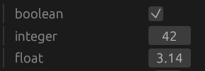
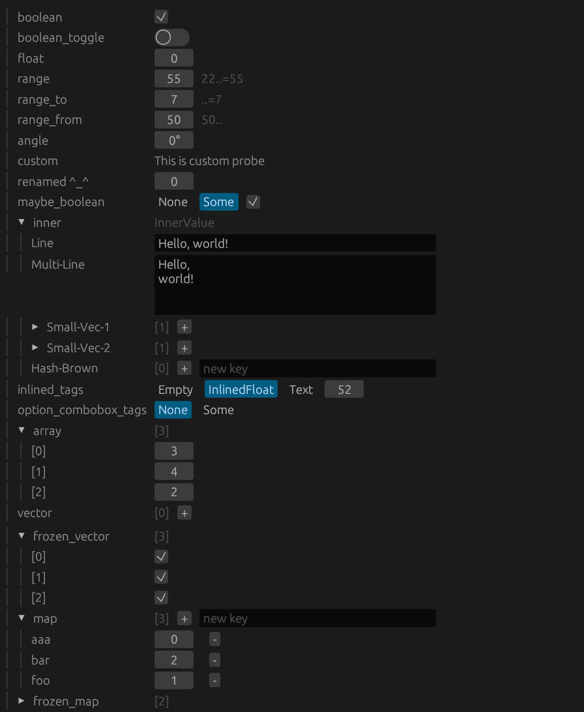

# Egui Probe

[](https://docs.rs/egui-probe/)
[](https://crates.io/crates/egui-probe)
[](https://discord.com/channels/1270330377847832646/1319419862719922289)

By the Machine Spirit's will, manifest interface widgets to observe and modify data-constructs through the derive macro protocol, enhanced with advanced customization through attribute bindings. This cogitator library serves the [egui](https://github.com/emilk/egui) UI framework exclusively.

## Features

- 🪄 **Derive Macro**: Through automated protocols, generate interface widgets for your data-types.
- 🎨 **Rich Customization**: Configure the generated widgets via attribute markers.
- 🚀 **Seamless Integration**: Engineered for optimal interfacing with the egui framework.

## Getting Started

Register the `egui_probe` dependency in your `Cargo.toml` manifest:

```toml
[dependencies]
egui_probe = "0.5.2"
```

## Usage

Apply the `EguiProbe` derivation protocol to your data-types.
Utilize attribute markers to configure the interface:

### Simple Example

```rust
#[derive(EguiProbe)]
struct SimpleValue {
    boolean: bool,
    integer: i32,
    float: f32,
}
```

The resulting interface manifestation:



### Advanced Example

```rust
struct Foo;

fn custom_probe(_: &mut Foo, ui: &mut egui::Ui, _: &egui_probe::Style) -> egui::Response {
    ui.label("This is custom probe")
}

#[derive(EguiProbe)]
#[egui_probe(transparent)]
struct UpTo7(#[egui_probe(range = ..=7)] u32);

#[derive(EguiProbe)]
#[egui_probe(tags inlined)]
enum InlinedTags {
    Empty,

    #[egui_probe(transparent)]
    InlinedFloat(f32),

    Text {
        #[egui_probe(multiline)]
        text: String,
    },
}

#[derive(EguiProbe)]
#[egui_probe(tags combobox)]
enum ComboBoxTags {
    Empty,

    Num { value: usize },
}

impl Default for ComboBoxTags {
    fn default() -> Self {
        ComboBoxTags::Empty
    }
}

#[derive(Default, EguiProbe)]
#[egui_probe(rename_all = Train-Case)]
struct InnerValue {
    line: String,

    #[egui_probe(multiline)]
    multi_line: String,

    #[cfg(feature = "smallvec1")]
    small_vec_1: smallvec1::SmallVec<[String; 4]>,

    #[cfg(feature = "smallvec2")]
    small_vec_2: smallvec2::SmallVec<f32, 4>,

    #[cfg(feature = "hashbrown")]
    hash_brown: hashbrown::HashMap<u8, f32>,
}

#[derive(EguiProbe)]
struct DemoValue {
    boolean: bool,

    #[egui_probe(toggle_switch)]
    boolean_toggle: bool,

    float: f32,

    #[egui_probe(range = 22..=55)]
    range: usize,

    range_to: UpTo7,

    #[egui_probe(range = 50..)]
    range_from: u8,

    #[egui_probe(as angle)]
    angle: f32,

    #[egui_probe(with custom_probe)]
    custom: Foo,

    #[egui_probe(name = "renamed ^_^")]
    renamed: u8,

    maybe_boolean: Option<bool>,

    inner: InnerValue,

    inlined_tags: InlinedTags,

    option_combobox_tags: Option<ComboBoxTags>,

    array: [u8; 3],

    vector: Vec<bool>,

    #[egui_probe(frozen)]
    frozen_vector: Vec<bool>,

    map: HashMap<String, u32>,

    #[egui_probe(frozen)]
    frozen_map: HashMap<String, u32>,
}
```

The resulting interface construct:



## Attributes

### Type Attributes

- `#[egui_probe(rename_all = kebab-case)]`: Transcode all field designations into the specified case format.
  Supported case protocols:
    - `snake_case`
    - `camelCase`
    - `kebab-case`
    - `PascalCase`
    - `SCREAMING_SNAKE_CASE` or `UPPER_SNAKE_CASE`
    - `Train-Case`

- `#[egui_probe(where TypeA: TraitB)]`: Appends constraint clauses to the `EguiProbe` implementation.
  Predicates follow standard Rust syntax protocols.

- `#[egui_probe(transparent)]`: Renders the complete type as its singular inner field.
  Compilation will abort if the type lacks exactly one non-skipped field.

- `#[egui_probe(tags kind)]`: Determines the rendering mechanism for enum variants.
  When `combobox` is specified, a combobox selector is employed.
  When `inlined` is specified, variants render inline via radio button controls.

### Variant Attributes

- `#[egui_probe(name = "custom name")]`: Override the variant designation in the interface.
- `#[egui_probe(transparent)]`: Renders the variant as its singular inner field.
  Compilation will abort if the variant lacks exactly one non-skipped field.

### Field Attributes

- `#[egui_probe(skip)]`: Exclude the field from interface rendering.
  This attribute cannot be combined with other attributes.

- `#[egui_probe(name = "custom name")]`: Override the field designation in the interface.

- `#[egui_probe(with probe_fn)]`: Render the field via a specified probe function
  with signature `fn(&mut FieldType, &mut Ui, &egui_probe::Style) -> egui::Response`.
  Note that `probe_fn` may be any expression, enabling closure usage.

- `#[egui_probe(as probe_fn)]`: Render the field via a specified probe function
  with signature `fn(&mut FieldType) -> impl EguiProbe`.
  This wraps the field in a type implementing the `EguiProbe` trait.

- `#[egui_probe(range = 22..=55)]`: Define bounds for numeric value manipulation.
  Compatible with optional types.

- `#[egui_probe(multiline)]`: Render string data as a multiline text input.
  Field type must be `String` or `&str`, or an optional variant thereof.

- `#[egui_probe(toggle_switch)]`: Render boolean values as a toggle switch mechanism.
  Field type must be `bool` or an optional variant thereof.

- `#[egui_probe(frozen)]`: Renders collections with element modification controls disabled.

- `#[egui_probe(rgb)]`: Render an opaque color picker in RGB color-space.
  Field type must be `egui::Color32`, `egui::Rgba`, `[u8; 3]` or `[f32; 3]`.

- `#[egui_probe(rgba)]`: Render a color picker in RGB space with alpha channel.
  Field type must be `egui::Color32` or `egui::Rgba`.

- `#[egui_probe(rgba_premultiplied)]`: Render a color picker in RGB space with premultiplied alpha. 
  For `egui::Color32` and `egui::Rgba` types, behaves identically to `#[egui_probe(rgba)]`.
  May also be applied to `[u8; 4]` and `[f32; 4]` arrays.

- `#[egui_probe(rgba_unmultiplied)]`: Render a color picker in RGB space with unmultiplied alpha. 
  Cannot be applied to `egui::Color32` and `egui::Rgba` types,
  as these types employ premultiplied alpha exclusively. May be applied to `[u8; 4]` and `[f32; 4]` arrays.

## License

This construct operates under either of the following license protocols

- MIT License
- Apache License, Version 2.0

at your discretion.

## Contributing

Code contributions are accepted. Please submit issue reports or pull requests through standard protocols.

May your interface constructs be efficient and your Machine Spirits be appeased! 🚀
